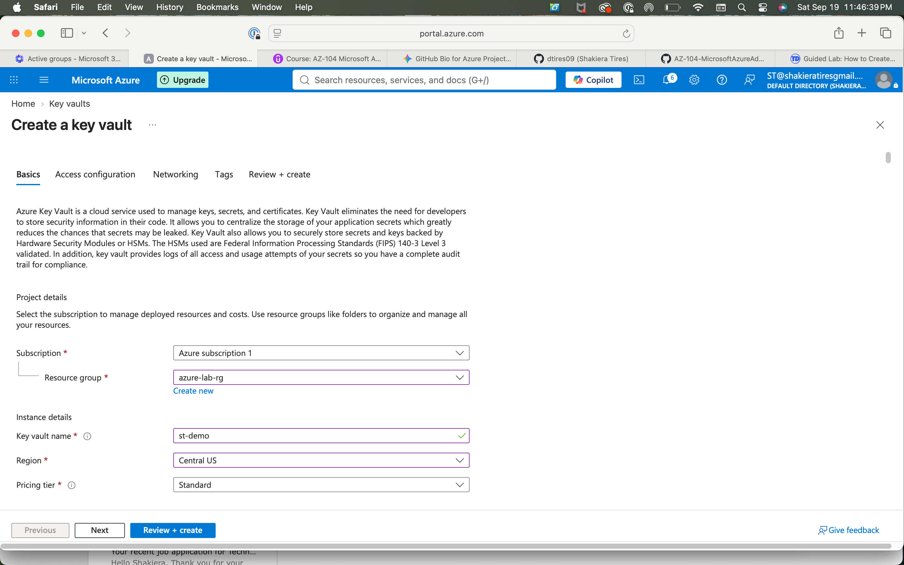
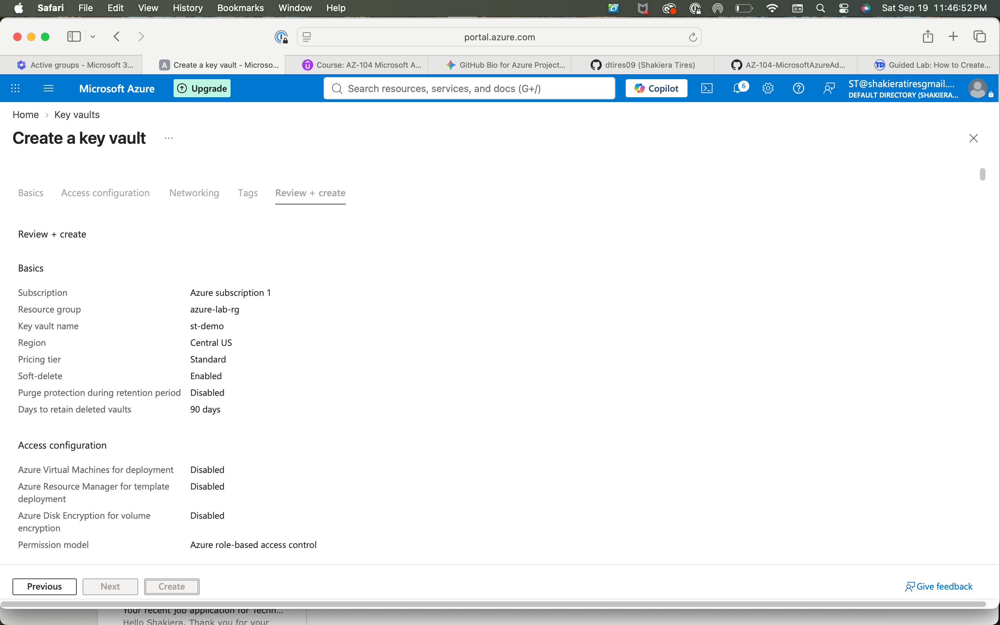
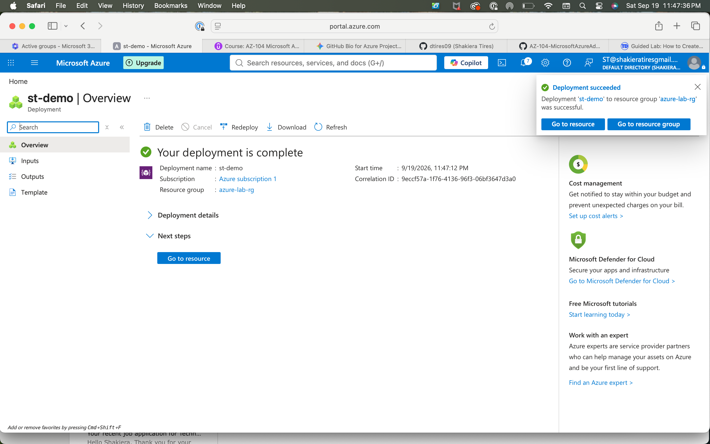

# Azure Key Vault Deployment & Secret Management Lab

## 🎯 Objective
Provisioned and configured a secure Azure Key Vault instance (`st-demo`) within the `azure-lab-rg` resource group, utilizing Azure RBAC authorization to manage cloud secrets and security credentials securely.

## 🛠️ Tech Stack & Concepts
* **Cloud Platform:** Microsoft Azure
* **Security & Governance:** Azure Key Vault, Azure Role-Based Access Control (RBAC)
* **Data Protection:** Soft-delete configurations, 90-day retention policies

---

## 📋 Implementation Walkthrough & Screenshots

### 1. Key Vault Instance Setup & Configuration
Configured foundational parameters for a new Azure Key Vault instance (`st-demo`), specifying the Central US region, Standard pricing tier, and soft-delete protections.
* **Configuring Project & Instance Details:**

* **Reviewing Security Settings & RBAC Permissions:**

### 2. Deployment & Resource Verification
Executed the deployment and verified a successful build confirmation within the Azure portal, ensuring the Key Vault resource is fully active and accessible.
* **Successful Deployment Confirmation:**

---

## 🚀 Key Takeaways
* Successfully provisioned an enterprise-grade Azure Key Vault utilizing Azure RBAC access governance.
* Implemented built-in security protections including soft-delete and customizable retention cycles to safeguard sensitive cloud assets.